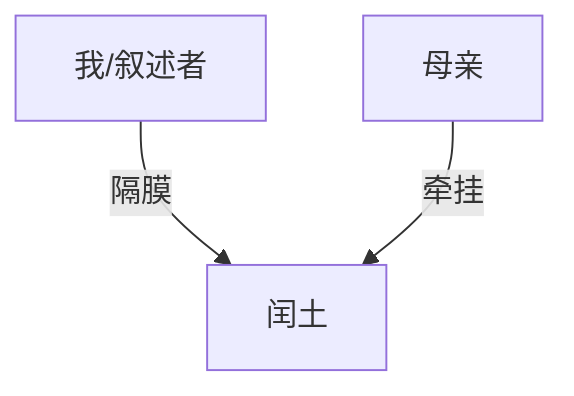

# close-read：结构化精读

这是分析管线的反向使用：不为模仿，为理解。输出永远落到 Markdown 报告。

## 报告模板（叙事类，写入 `<项目>/reviews/close-read/<作品名>.md`）

1. **一句话总评**：作品在写什么，靠什么立住
2. **人物图谱**（Mermaid graph，必须渲染通过）：

节点 = 人物（标注身份），边 = 关系（边上写关系性质；可加虚线表示"隐藏关系"）。
Mermaid 标签避免使用引号/括号等特殊字符，避免渲染失败。

3. **时间线**：按叙事顺序列出事件（标注故事时间 vs 叙述顺序的差异，如倒叙插叙）
4. **伏笔清单**：两列表——埋设（章节+摘句 ≤ 30 字）/ 回收（章节+摘句）；未回收的明确标出
5. **章节功能结构**：每章/每段一句话标注功能（立人物 / 转 / 合 / 抒情缓冲……）
6. **风格观察**：3–5 条，每条附一处摘句（≤ 40 字）说明作者如何做到
7. **可迁移性**：哪些手法可以搬进自己的写作、哪些依赖语境

## 学习资料变体

第 2–4 项替换为：**论点结构**（中心论点 → 分论点 → 论据树，Mermaid graph）、
**概念依赖表**（先学什么后学什么）、**自测问题清单**（每节 2–3 问）。

## 纪律

- 每个结论都要有原文定位；摘句 ≤ 40 字（版权短引纪律）
- 不确定的推断标注"推测"，与文本直接支持的结论分开
- 报告末尾附「如何验证」：给出 1–2 个可复查的检验点
